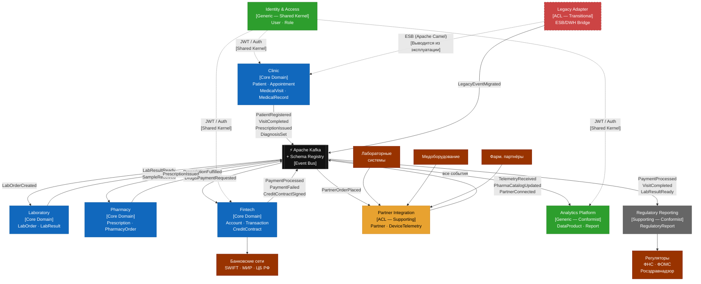

# Bounded Contexts — «Будущее 2.0»

> DDD-декомпозиция системы. Горизонт: целевая архитектура через 3 года.

---

## Реестр ограниченных контекстов

| Контекст | Тип | DDD-классификация | Команда-владелец |
|---|---|---|---|
| Clinic | Core Domain | Upstream / Customer | Clinic Domain Team |
| Laboratory | Core Domain | Downstream / Supplier | Lab Domain Team |
| Pharmacy | Core Domain | Downstream / Supplier | Pharmacy Domain Team |
| Fintech | Core Domain | Peer (независимый) | Fintech Domain Team |
| Partner Integration | Supporting Domain | Anti-Corruption Layer | Integration Team |
| Analytics Platform | Generic Domain | Conformist (downstream) | Data Platform Team |
| Regulatory Reporting | Supporting Domain | Conformist (downstream) | Compliance Team |
| Identity & Access | Generic Domain | Shared Kernel | Platform Engineering |
| Legacy Adapter | Transitional | Anti-Corruption Layer (временный) | Migration Team |

---

## Описание контекстов

### 1. Clinic (Core Domain)
Управляет основным медицинским процессом: регистрация пациентов, запись на приём, проведение визита, постановка диагноза, выписка направлений. Является **главным upstream-контекстом** системы — большинство бизнес-событий начинается здесь.

**Язык домена:** пациент, визит, диагноз, назначение, рецепт, врач, расписание.  
**Ключевые агрегаты:** `Patient`, `Appointment`, `MedicalVisit`, `MedicalRecord`.  
**Граница:** всё, что происходит от момента обращения пациента до окончания визита и выдачи документов.

---

### 2. Laboratory (Core Domain)
Обрабатывает лабораторные заказы и результаты исследований. Является **downstream** по отношению к Clinic (получает направления), но **upstream** для аналитики и обновления медицинской карты.

**Язык домена:** заказ на анализ, образец, результат, референсные значения, исследование.  
**Ключевые агрегаты:** `LabOrder`, `LabResult`.  
**Граница:** от получения направления до публикации верифицированного результата.  
**Внешняя система:** интеграция с аппаратными лабораторными системами через адаптер.

---

### 3. Pharmacy (Core Domain)
Управляет отпуском лекарственных препаратов по рецептам, заказами у фармацевтических партнёров, остатками склада.

**Язык домена:** рецепт, препарат, доза, остаток, отпуск, заказ поставщику.  
**Ключевые агрегаты:** `Prescription`, `PharmacyOrder`.  
**Граница:** от получения рецепта до подтверждения отпуска пациенту.  
**Зависимость:** Partner Integration (каталог препаратов фарм-партнёров).

---

### 4. Fintech (Core Domain)
Предоставляет финансовые сервисы: платёжные операции за медицинские услуги, кредитные продукты, счета клиентов. Работает в рамках требований ЦБ РФ.

**Язык домена:** счёт, транзакция, платёж, кредитный договор, лимит, ставка.  
**Ключевые агрегаты:** `Account`, `Transaction`, `CreditContract`.  
**Граница:** от инициации финансовой операции до её завершения и подтверждения.  
**Внешние системы:** SWIFT, МИР, ЦБ РФ через банковские сети.

---

### 5. Partner Integration (Supporting Domain — ACL)
Антикоррупционный слой для взаимодействия с внешними партнёрами: фармацевтическими компаниями и производителями медицинского оборудования. Нормализует внешние форматы данных в доменные события системы.

**Язык домена:** партнёр, интеграция, телеметрия, каталог, заказ партнёру.  
**Ключевые агрегаты:** `Partner`, `DeviceTelemetry`.  
**Граница:** от регистрации партнёра до нормализации входящих данных в формат системы.

---

### 6. Analytics Platform (Generic Domain — Conformist)
Потребляет события всех доменов, строит аналитические Data Products, предоставляет портал самообслуживания для бизнес-аналитиков. Конформист — не влияет на контракты upstream-контекстов.

**Язык домена:** data product, дашборд, отчёт, витрина, метрика.  
**Ключевые агрегаты:** `DataProduct`, `AnalyticsReport`.  
**Граница:** потребление событий → построение аналитических моделей → публикация data products.

---

### 7. Regulatory Reporting (Supporting Domain — Conformist)
Формирует отчётность для регуляторов: ФНС, ЦБ РФ, Росздравнадзор, ФОМС. Подписывается на события Fintech и Clinic.

**Язык домена:** отчётная форма, период, регулятор, проводка, уведомление.  
**Ключевые агрегаты:** `RegulatoryReport`, `ComplianceCheck`.  
**Граница:** агрегация событий → трансформация → отправка регулятору.

---

### 8. Identity & Access (Generic Domain — Shared Kernel)
Единая система идентификации и управления доступом для всех контекстов. Предоставляет минимальный общий компонент (JWT-токены, роли) — **Shared Kernel** по DDD-паттерну.

**Язык домена:** пользователь, роль, сессия, разрешение, токен.  
**Ключевые агрегаты:** `User`, `Role`.  
**Граница:** создание и управление учётными записями, выдача токенов доступа.

---

### 9. Legacy Adapter (Transitional — ACL)
Временный антикоррупционный слой на переходный период. Обёртывает существующую ESB-шину (Apache Camel) и DWH (SQL Server 2008), транслируя legacy-вызовы в доменные события Kafka. Выводится из эксплуатации по мере завершения миграции.

**Граница:** ESB/DWH → Kafka-события. Не содержит бизнес-логики.

---

## Схема bounded contexts и интеграций

---

## Паттерны взаимодействия между контекстами

| Upstream | Downstream | DDD-паттерн | Механизм |
|---|---|---|---|
| Clinic | Laboratory | Customer / Supplier | Kafka event `LabOrderCreated` |
| Clinic | Pharmacy | Customer / Supplier | Kafka event `PrescriptionIssued` |
| Clinic | Fintech | Customer / Supplier | Kafka event `PaymentRequested` |
| Clinic | Analytics | Published Language | Kafka topic + Avro schema |
| Fintech | Analytics | Published Language | Kafka topic + Avro schema |
| Fintech | Regulatory | Published Language | Kafka topic + Avro schema |
| Lab | Clinic | Customer / Supplier | Kafka event `LabResultReady` |
| External Partners | Partner Integration | Anti-Corruption Layer | REST / MQTT → normalized events |
| ESB / DWH | Legacy Adapter | Anti-Corruption Layer | ESB calls → Kafka events |
| Identity | All Contexts | Shared Kernel | JWT tokens, Role claims |
| Analytics | Business Analysts | Open Host Service | Self-service BI portal |
