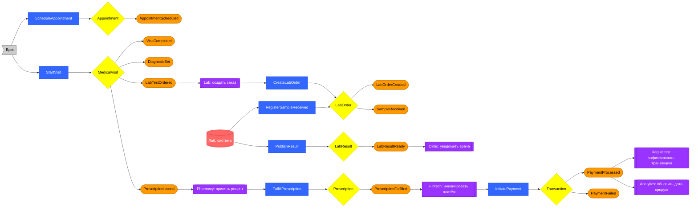
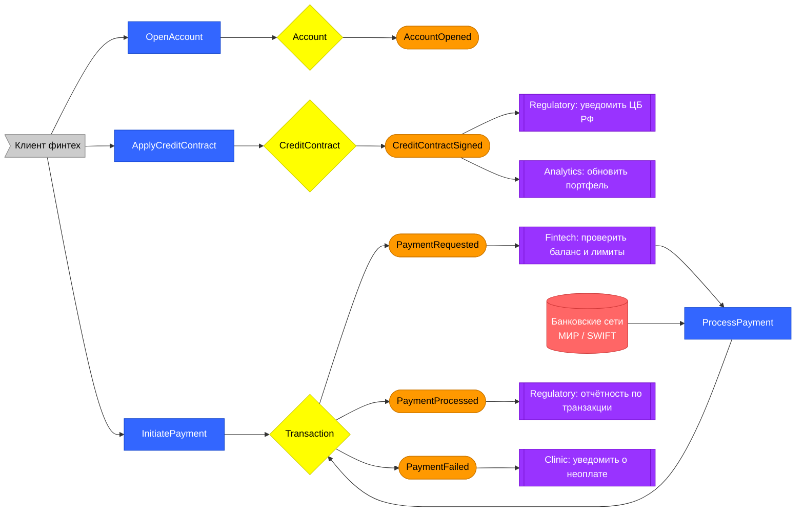
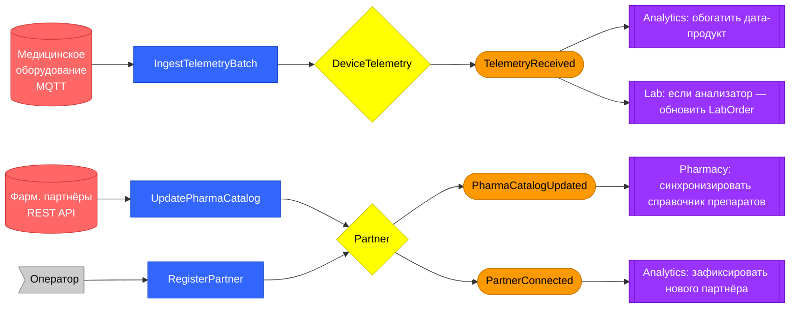
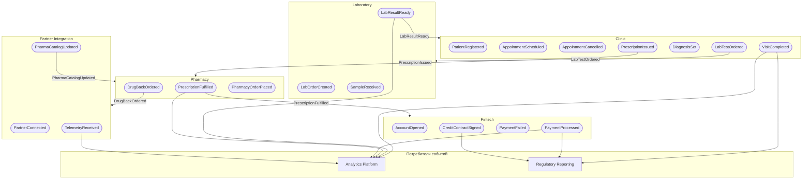

# Event Storming — «Будущее 2.0»

> Событийный штурм (Event Storming) — техника визуализации бизнес-потоков через доменные события.  
> Документ моделирует три ключевых бизнес-сценария системы.

## Условные обозначения

| Обозначение | Тип | Описание |
|---|---|---|
| `([Событие])` | **Domain Event** (оранжевый) | Факт, произошедший в прошлом |
| `[Команда]` | **Command** (синий) | Намерение изменить состояние системы |
| `{Агрегат}` | **Aggregate** (жёлтый) | Агрегат, обрабатывающий команду и публикующий событие |
| `[[Политика]]` | **Policy / Reaction** (фиолетовый) | Автоматическая реакция на событие |
| `>Актор]` | **Actor** | Пользователь или система, инициирующие команду |
| `[(Внешняя)]` | **External System** (розовый) | Внешняя система |

---

## Сценарий 1: Визит пациента → лаборатория → фармация → оплата

Полный цикл от записи пациента до оплаты назначенного лечения.

---

## Сценарий 2: Финтех — кредитный договор и платёжные операции

---

## Сценарий 3: Интеграция партнёров — телеметрия и фарм-каталог

---

## Сводная карта событий по доменам

---

## Ключевые политики (реакции на события)

| Событие-триггер | Политика | Действие | Исполнитель |
|---|---|---|---|
| `LabTestOrdered` | Lab: создать заказ | `CreateLabOrder` | Laboratory |
| `LabResultReady` | Clinic: уведомить врача | Push-уведомление / обновление карты | Clinic |
| `PrescriptionIssued` | Pharmacy: принять рецепт | `AcceptPrescription` | Pharmacy |
| `DrugBackOrdered` | Partner: заказать препарат | `PlacePharmacyOrder` → партнёру | Partner Integration |
| `PrescriptionFulfilled` | Fintech: инициировать платёж | `InitiatePayment` | Fintech |
| `PaymentFailed` | Clinic: уведомить о неоплате | Изменение статуса визита | Clinic |
| `PaymentProcessed` | Regulatory: зафиксировать | Добавить в отчёт ЦБ РФ | Regulatory |
| `CreditContractSigned` | Regulatory: уведомить ЦБ РФ | Отчётная форма | Regulatory |
| `PharmaCatalogUpdated` | Pharmacy: синхронизировать | Обновить локальный справочник | Pharmacy |
| `TelemetryReceived` | Analytics: обогатить | Обновить data product устройств | Analytics |
| `UserDeactivated` | Все: инвалидировать сессии | Отзыв JWT-токенов | Identity → все |
